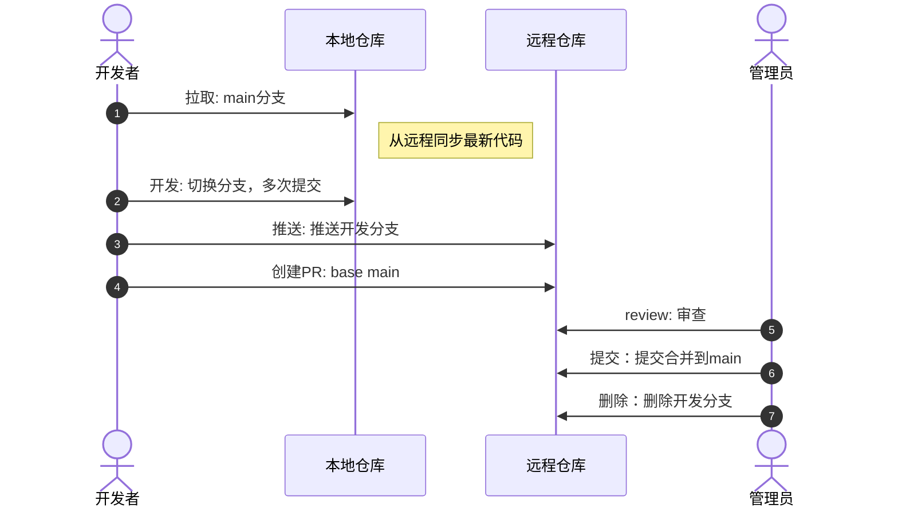

# git从入门到精通

## git核心概念和命令

### 动机


### 安装

- windows: 从[https://git-scm.com/install/](https://git-scm.com/downloads)下载安装包，双击运行安装即可。
- mac: 自带git，无需安装。
- *linux: 使用命令 `sudo apt-get install git` 安装。*

### 配置

配置命令：

```shell
git config -l # 查看当前生效的所有配置
git config 键 # 查看当前生效的某个配置的值
git config --范围 键 "值" # 更新配置
```

#### 配置范围

- *`worktree`: 仅对当前工作树生效*
- `local`: 【常见】【默认】仅对当前仓库有效
- `global`: 【常见】对当前用户的所有仓库有效
- *`system`: 对所有用户有效*

优先级从高到底：*`worktree` >* `local` > `global` *> `system`*

#### 常见配置

- `user.name`: 【必配】配置用户名。后续提交会使用该用户名。
- `user.email`: 【必配】配置邮箱。后续提交会使用该邮箱。
- `core.editor`: 配置默认文本编辑器。
- `core.ignorecase`: 配置是否忽略文件名的大小写。默认是 `true`，即忽略大小写。
- `init.defaultbranch`：配置初始化后默认的分支名

```shell
git config --global user.name "Your Name"
git config --global user.email "your.email@example.com"
git config --global core.editor "code --wait"
git config --global core.ignorecase false
git config --global init.defaultbranch "main"
```

### 初始化

要对一个目录使用git进行版本管理，必须先将该目录设置为git仓库。

使用 `git init` 命令初始化一个新的git仓库。

该命令会在当前目录下创建一个 `.git` 目录，该目录就是git仓库，里面记录了仓库的所有信息。该目录不可删除，一旦删除，该仓库就不存在了。

### .gitignore文件

仓库中某些文件是「个人专属」，不会在团队间共享，可以使用`.gitignore`文件将不需要的文件排除。

### 暂存和提交

#### 核心概念


#### 如何提交

提交分为两步：

1. 【可选】查看当前状态
   ```shell
   git status
   ```

2. 将改动暂存起来

   ```shell
   git add <file1> <file2> # 暂存指定文件
   git add . # 暂存当前目录及子目录下的所有文件
   ```

3. 将暂存的内容一起提交
   ```shell
   git commit # 会打开默认文本编辑器，你可以在编辑器中编写提交信息
   git commit -m "提交信息" # 直接在命令行中编写提交信息，不会打开文本编辑器
   ```


术语：

1. 工作区：包含真实文件
2. 暂存区：包含暂存的文件

#### 提交消息规范

| 提交类型     | 标识符     | 说明                       | 示例                           |
| :----------- | :--------- | :------------------------- | :----------------------------- |
| **功能新增** | `feat`     | 新增功能或特性             | `feat: 添加用户登录功能`       |
| **问题修复** | `fix`      | 修复bug或问题              | `fix: 修复登录超时问题`        |
| **文档更新** | `docs`     | 仅文档变更                 | `docs: 更新API使用说明`        |
| **代码风格** | `style`    | 代码格式调整（不影响功能） | `style: 调整代码缩进格式`      |
| **代码重构** | `refactor` | 代码重构（非功能变更）     | `refactor: 重构用户认证模块`   |
| **性能优化** | `perf`     | 性能优化相关               | `perf: 优化数据库查询性能`     |
| **测试相关** | `test`     | 测试用例相关               | `test: 添加登录功能单元测试`   |
| **构建系统** | `build`    | 构建系统或外部依赖变更     | `build: 更新webpack配置`       |
| **持续集成** | `ci`       | CI/CD配置变更              | `ci: 添加GitHub Actions工作流` |
| **工具变更** | `chore`    | 构建过程或辅助工具变更     | `chore: 更新依赖包版本`        |
| **回滚操作** | `revert`   | 回滚之前的提交             | `revert: 回滚错误的合并提交`   |

#### 提交消息修改

```shell
git commit --amend
```

该命令通常用于修改最新的提交消息。

所以使用该命令时，要确保自己所在的位置在最新的位置。

> 最佳实践1：
>
> 1. 编写提交消息时，尽量不要犯错
> 2. 提交后，立即审核提交消息，发现消息错误，立即通过上面的命令修复
>
> 最佳实践2: 让AI编写提交消息，审核后发布

#### 回滚某个提交

```shell
 git restore --source 提交id . # 将指定的提交覆盖到当前工作区根目录 
```

使用上述命令时，要确保工作区干净（暂存区没东西，工作区无更改）

### 分支管理


分支基本操作：

1. 查看分支

   ```shell
   git branch
   ```

2. 分支重命名

   ```shell
   git branch -m <new-name> # 重命名当前分支
   git branch -m <old-name> <new-name> # 重命名指定分支
   ```

3. 创建分支

   ```shell
   git branch <branch-name> # 创建一个新的分支，指针和当前分支相同
   git branch <branch-name> <commit-hash> # 创建一个新的分支，指针指向指定的提交
   ```

4. 切换分支

   ```shell
   git switch <branch-name> # 切换到指定分支
   git switch - # 切换到上一个分支，非常方便的在两个分支间来回切换
   ```

   > 创建并切换分支快捷方式：`git switch -c <branch-name>`

5. 删除分支

   ```shell
   git branch -d <branch-name> # 删除指定分支
   git branch -D <branch-name> # 强制删除指定分支
   ```

#### 分支基本生命周期

==永远不能在主分支上直接改动，主分支永远保证功能完整可用、可部署==

1. **新需求**
   功能/bug修复/版本回滚/...

2. **新建分支**

   ```
   feature/*     - 新功能开发
   bugfix/*      - 缺陷修复
   hotfix/*      - 紧急生产修复
   release/*     - 版本发布
   chore/*       - 维护性任务
   docs/*        - 文档更新
   refactor/*    - 代码重构
   ```

3. **在分支上开发测试**
   可能产生多次提交

4. **合并到主分支**

5. **主分支测试/部署**

6. **删除开发分支**

#### 分支常见问题

##### 如何保留现场

```shell
git stash -a # 保存当前工作区的修改到存储库
# 切换分支工作...
# 切回分支
git stash list # [可选]查询当前存储库
git stash pop <stash-id> # 调用某个存储库恢复工作区，同时删除存储库
# 如果存储库是最后一个，可以省略id
```

##### 如何解决冲突

**冲突必须手动解决，尤其是主分支的冲突。**

### 远程仓库


#### 注册github账号

https://github.com/

自行注册

#### SSH连接通道配置


##### 生成密钥对

本地生成密钥对

> windows电脑必须打开powershell，而不是普通终端
>
> mac电脑随意

```shell
ssh-keygen -t ed25519 -C "注册github的邮箱地址" -f ~/.ssh/xxx_github_key
```

命令后续交互保持默认即可。

生成完后，到电脑的`~/.ssh`目录即可看到之前生成的两个文件：

> windows电脑的位置在`c:/Users/你的用户名/.ssh`

```shell
xxx_github_key   		# 这是私钥
xxx_github_key.pub 	# 这是公钥 
```

##### 到github配置公钥

https://github.com/settings/keys

自行配置

##### 配置密钥配对规则


1. 打开`~/.ssh/config`，没有就创建一个

2. 配置规则
   ```yaml
   # 规则1
   Host gmail.github.com  # 当连接 git@gmail.github.com 时会匹配到此规则
     HostName github.com  # 实际上链接发出的主机
     IdentityFile ~/.ssh/gmail_github_key # 使用的私钥文件  
     User git # 固定写法
   ```

3. 测试连接
   ```shell
   ssh -T git@你配置的主机名
   ```

   成功的结果是：
   ```
   Hi xxx! You've successfully authenticated ...
   ```

   

#### 仓库和别名

要和远程仓库同步，先得有远程仓库

1. 在github中创建远程仓库

2. 在本地仓库中添加远程仓库的别名


别名常见操作

   ```shell
   # 查看当前的远程仓库别名
   git remote    	# 简要信息
   git remote -v  	# 详细信息
   
   # 添加别名
   git remote add 远程仓库别名 远程仓库ssh地址
   
   # 修改别名
   git remote rename 原别名 新别名
   
   # 删除别名
   git remote remove 要删除的别名
   ```

#### 分支同步

##### push命令


```shell
# 将本地的某个分支推送到指定仓库
git push -u 远程仓库别名 本地分支名 
```

细节：

- 如果远程没有相关分支，则在远程创建同名分支
- 推送完成后，会在本地创建远程跟踪分支
  - 跟踪分支自动命名：`仓库别名/分支名`
  - 跟踪分支是只读的，它的目的在于同步远程分支
  - 推送完成后，会自动同步远程跟踪分支
- 由于使用了参数`-u`，在跟踪分支创建后，会自动把本地分支`main`绑定到跟踪分支`origin/main`
  - 后续仅需要使用`git push`即可推送当前的`main`分支


这样，就完成了本地到远程的同步

##### pull命令


1. 使用`git fetch`命令
   ```shell
   git fetch 远程仓库别名 远程分支名
   ```

   - 如果本地没有跟踪分支，则创建跟踪分支

2. 使用`git merge`命令合并分支
   ```shell
   # 确保当前在对应分支上
   git merge 本地跟踪分支名
   ```


这样，就完成了远程到本地的同步。

使用`git pull`快捷命令，可以一步替代上面两步操作

```shell
git pull 远程仓库别名 远程分支
```

##### 克隆操作

当本地没有工程时，可以使用`git clone`操作快速完成远程仓库的下载

```shell
git clone [-b 分支名] 远程仓库地址 [想要保存的文件夹]
```

#### 同步的三种情况

==情况一：远程快进==


==情况二：本地快进==


==情况三：解决冲突==


简单总结：

1. 正常推送拉取，没问题什么也不管
2. 推送报错，进入第3步
3. 拉取有冲突，解决冲突重新提交，然后进入第2步

## github flow

### 完整流程




**开发者规范：**

1. **main分支只读**
2. **基于最新提交开发**


**管理员规范**

1. **main分支只能通过PR修改**
2. **PR永远无冲突**


### 各个环节的细节

#### 协作者流程

和管理员开发基本相同，差异点：

1. 管理员需要添加协作者
2. PR时必须review

#### 非协作者(陌生人)流程

前期准备

1. fork仓库

2. 克隆fork仓库

3. 添加原仓库源
   ```shell
   # 添加上游
   git remote add upstream https://github.com/原作者/仓库名.git
   # 查看远程源（确认 origin 是你的 Fork，upstream 是原仓库）
   git remote -v
   ```

贡献流程：

和之前的流程一致，区别点：

1. 拉取最新代码

```shell
git switch main
git fetch upstream
git merge upstream/main
# 推回自己的 Fork
git push origin main
```

2. 提交PR

需要到自己仓库主页提交PR

#### 冲突变基处理

merge vs rebase


rebase是一个过程，无法立即完成


#### cherry-pick


#### 工作流


> 完整配置规范：https://docs.github.com/zh/actions/reference/workflows-and-actions/workflow-syntax
>
> 
>
> 上下文：https://docs.github.com/en/actions/reference/workflows-and-actions/contexts
>
> 
>
> actions: https://github.com/actions
>


#### tag和release

**时机：当需要对外发布版本时**

```shell
# 格式：git tag -a <标签名> -m "<备注信息>" [可选：指定提交哈希]
# 示例1：给当前最新提交打标签（比如 v1.0.0 正式版）
git tag -a v1.0.0 -m "发布v1.0.0正式版：支持用户登录、订单管理功能"

# 示例2：给历史提交打标签（比如补打v0.9.0测试版，假设提交哈希是a1b2c3d）
git tag -a v0.9.0 -m "测试版v0.9.0：完成核心功能开发" a1b2c3d

git tag  # 列出所有标签（按字母排序）
git tag -l "v1.*"  # 筛选标签（比如只看v1开头的）
git show v1.0.0    # 查看标签详情（附注标签会显示完整信息，轻量标签仅显示提交）

# 推送单个标签
git push origin v1.0.0

# 推送所有本地未推送的标签
git push origin --tags

# 删除本地标签
git tag -d v1.0.0

# 删除远程标签（先删本地，再推远程）
git tag -d v1.0.0
git push origin :refs/tags/v1.0.0

# 检出标签（创建分支基于标签，避免直接在标签上修改，因为标签不可移动）
git checkout -b release-v1.0.0 v1.0.0
```

## gitlab flow


## 技巧

### worktree

```shell
# 基本用法：git worktree add <新工作目录路径> <分支名>
git worktree add ../my-project-feat feat-123
# 如果分支不存在，可加 -b 创建并检出
git worktree add -b feat-new ../my-project-new
# 查看已创建的 worktree
git worktree list
# 删除 worktree
git worktree remove ~/project-feat
```

